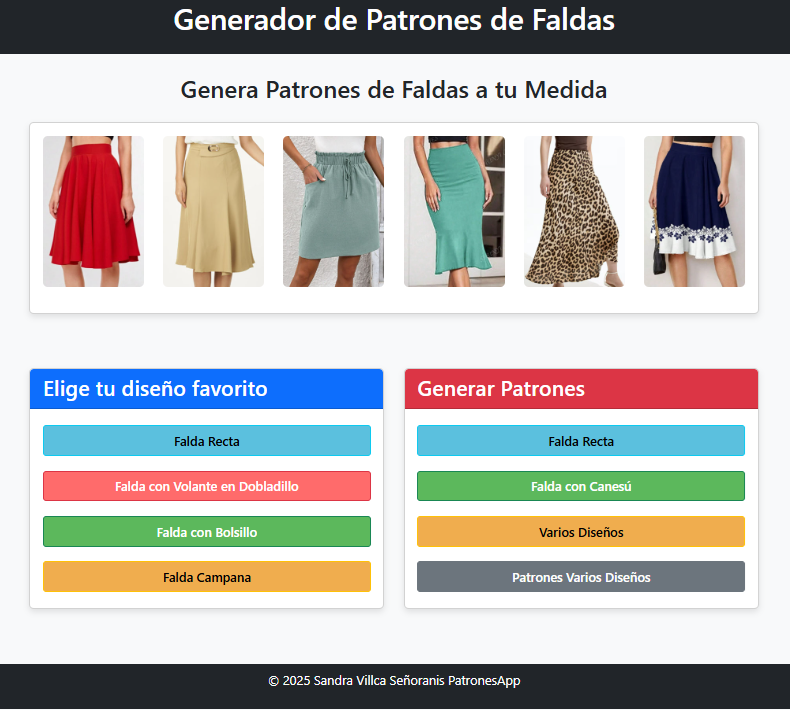
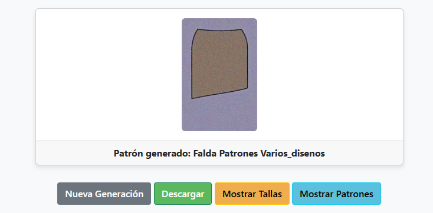
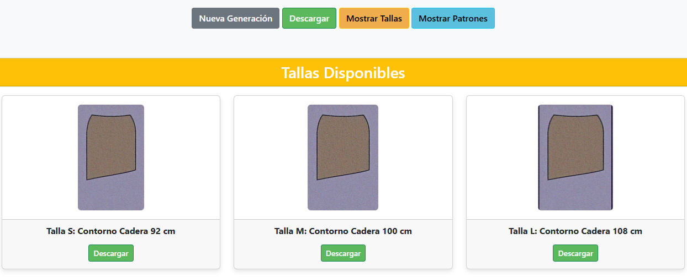
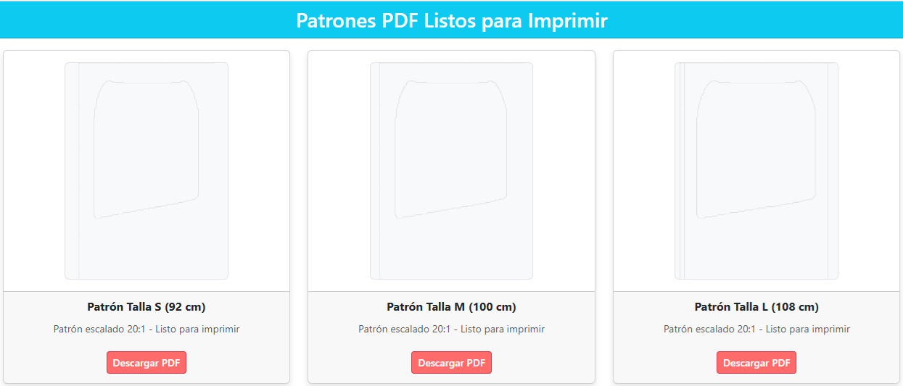

# PatronesApp

## Información del Proyecto

- **Autor:** Sandra Villca
- **Contacto:** sandra.usfx@gmail.com
- **Institución:** Universidad Mayor, Real y Pontificia de San Francisco Xavier de Chuquisaca
- **Carrera:** Ciencias de la Computación
- **Semestre:** 7mo
- **Materia:** Desarrollo de Aplicaciones Inteligentes
- **Docente:** Ing. Carlos Pacheco

## Descripción

PatronesApp es una aplicación web basada en Flask diseñada para generar patrones de faldas utilizando modelos de difusión de aprendizaje profundo. Los usuarios pueden seleccionar diferentes tipos de faldas (por ejemplo, recta, con volantes o con bolsillos), generar patrones, y obtener variaciones de tallas (S, M, L) en formatos PNG, SVG y PDF para impresión y costura. La aplicación utiliza modelos de difusión preentrenados para crear imágenes de alta calidad e incluye procesamiento de imágenes para ajustes de tallas y vectorización para la creación de patrones.

## Características

- Generación de patrones de costura para varios tipos de faldas.
- Soporte para múltiples estilos de falda: recta, con canesú y varios diseños.
- Generación de patrones en tallas S, M y L con ajustes automáticos de ancho.
- Conversión de patrones a formatos PDF con reglas para medidas precisas.
- Interfaz web amigable construida con Flask y plantillas Jinja2.
- Modelos de difusión preentrenados para una generación eficiente de imágenes.

## Estructura de Carpetas

La estructura de carpetas del proyecto es la siguiente:

```
PatronesApp/
│
├── libEnv/                                    # Carpeta del entorno virtual (no incluida en el repositorio)
├── models/                                    # Directorio para puntos de control de modelos preentrenados
│   ├── checkpoint_patron_recta.pth           # Punto de control para patrón de falda recta
│   ├── checkpoint_patron_varios_disenos.pth  # Punto de control para varios diseños de patrones
│
├── services/                                  # Módulos Python para servicios principales de la aplicación
│   ├── diffusion_service.py                  # Gestiona la generación de imágenes usando modelos de difusión
│   ├── pattern_service.py                    # Convierte imágenes PNG a patrones SVG/PDF con reglas
│   ├── size_service.py                       # Genera variaciones de tallas (S, M, L) para patrones
│
├── static/                                    # Recursos estáticos para la aplicación web
│   ├── css/                                  # Hojas de estilo CSS para el frontend
│   ├── downloads/                            # Imágenes generadas de los patrones se guardan aquí
│   ├── patterns/                             # Archivos de patrones SVG y PDF se guardan aquí
│   ├── public/                               # Imágenes accesibles públicamente
│   │   ├── skirt1.jpg
│   │   ├── skirt2.jpg
│   │   └── readme-images/                   # Imágenes para documentación README
│   │       ├── patron-seleccion.png
│   │       ├── tallas-generadas.png
│   │       ├── patrones-completos.png
│   │       └── descarga-pdf.png
│   ├── tallas/                               # Imágenes ajustadas por talla (S, M, L) se guardan aquí
│
├── templates/                                 # Plantillas HTML para la interfaz web
│   ├── base.html
│   ├── design_result.html
│   ├── index.html
│   ├── pattern_result.html
│
├── app.py                                     # Inicialización y configuración de la aplicación Flask
├── requirements.txt                           # Lista de dependencias de Python
├── routes.py                                  # Rutas de Flask para endpoints API y renderizado de páginas
├── run.py                                     # Punto de entrada para ejecutar la aplicación Flask
```

## Instalación

Para ejecutar PatronesApp localmente, necesitas configurar un entorno virtual de Python e instalar las dependencias requeridas. A continuación, se detallan los pasos:

### Requisitos Previos

- Visual Studio Code (recomendado para desarrollo).
- Python 3.8 o superior instalado.
- pip (gestor de paquetes de Python).
- Se recomienda una GPU compatible con CUDA para una generación de imágenes más rápida.

### Pasos

1. **Instalar virtualenv:** Abre una terminal e instala el paquete virtualenv si no está instalado:

   ```bash
   pip install virtualenv
   ```

2. **Descargar la Aplicación:** Clona o descarga el repositorio PatronesApp desde GitHub:

   ```bash
   git clone https://github.com/sandra-usfx/PatronesApp
   cd PatronesApp
   ```

3. **Abrir en Visual Studio Code:** Inicia Visual Studio Code y abre la carpeta PatronesApp:

   ```bash
   code .
   ```

4. **Crear un Entorno Virtual:** En la terminal (dentro de la raíz del proyecto), crea un entorno virtual llamado libEnv (o el nombre que prefieras):

   ```bash
   virtualenv libEnv
   ```

5. **Activar el Entorno Virtual:**

   En Windows, activa el entorno virtual usando PowerShell:

   ```powershell
   .\libEnv\Scripts\Activate.ps1
   ```

   En macOS/Linux, usa:

   ```bash
   source libEnv/bin/activate
   ```

6. **Instalar Dependencias:** Con el entorno virtual activado, instala todas las dependencias listadas en requirements.txt:

   ```bash
   pip install -r requirements.txt
   ```

7. **Ejecutar la Aplicación:** Después de instalar las dependencias, inicia la aplicación Flask:

   ```bash
   python run.py
   ```

   La aplicación se iniciará en modo de depuración, y podrás acceder a ella en http://localhost:5000 desde tu navegador web.

## Uso

1. Abre la aplicación en tu navegador (http://localhost:5000).

   

2. En la sección Generar Patrones, selecciona un tipo de falda (por ejemplo, "Patrones Varios Diseños").

3. Visualiza la imagen generada y procede a generar variaciones de tallas (S, M, L) haciendo clic en la opción **Mostrar Tallas**.

   

4. Visualiza las 3 tallas generadas (S, M, L) y procede a generar los patrones de las tallas haciendo clic en la opción **Mostrar Patrones**.

   

5. Descarga los patrones en formato PDF para su impresión y confección. Los patrones en formato PDF tienen tamaño real en centímetros de la tallas.

   

## Nota

La carpeta models/ contiene solo un punto de control del modelo "Patrones Varios Diseños" debido al gran tamaño de los archivos de checkpoints. Se recomienda generar los patrones de falda seleccionando la opción "Patrones Varios Diseños" que representa distintos diseños de faldas.

## Presentación y Artículo Científico

Para mayor información sobre éste proyecto, puedes abrir los archivos Presentacion-Aplicacion.pdf y Articulo-Cientifico.pdf.

## Licencia

Este proyecto está licenciado bajo la Licencia MIT - ver el archivo [LICENSE](LICENSE) para más detalles.
